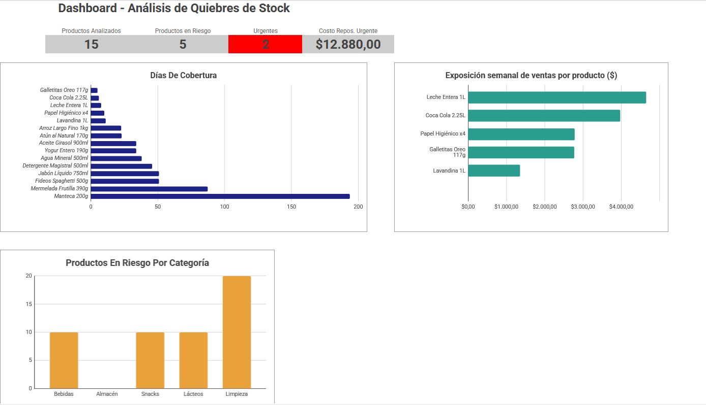

# Inventory Stockout Risk Analysis — Portfolio Project

**Author:** Maximiliano Soria

**Tools:** Google Sheets (VLOOKUP, SUMIF, COUNTIFS, nested IF, conditional formatting) + SQL (SQLite: LEFT JOIN, GROUP BY, CASE WHEN, CTEs, views)

*Synthetic dataset, designed to reproduce a realistic retail operations scenario (see full note at the end).*

## Executive summary

| KPI | Result |
|---|---|
| Products analyzed | 15 |
| Products in URGENT status | 2 |
| Products in ATTENTION status | 3 |
| Products below minimum stock | 8 |
| Cost to restore minimum stock (all products) | $26,620 |
| Estimated weekly sales exposure — URGENT products | ~$6,732 |

## Context

During my experience in retail operations, one of my direct responsibilities was inventory and stock control. This project reconstructs that process using representative data, to systematically analyze which products are genuinely at risk of running out of stock — not just which ones are below their minimum level, but which ones will run out of stock *soon*, based on their actual sales pace.

## Methodology

- The sales log and the product master are linked by product ID: VLOOKUP brings stock levels into the sales log and each product's category into the product table, while SUMIF totals the units sold per product. Dividing by the days covered by the log gives each product's daily sales pace.
- For each product, days of remaining stock coverage were projected at the current sales pace (Current_Stock ÷ Average_Daily_Sales).
- Each product was classified as URGENT, ATTENTION, OK or NO SALES based on days of remaining stock (the files use the Spanish labels URGENTE / ATENCIÓN / OK / SIN ROTACIÓN; no product falls in the last group in this dataset).
- Impact was quantified across two business dimensions: the cost of restocking before sales are cut off, and sales exposure in the event of a stockout.

## Key findings

- **2 products in URGENT status** (7 days or less of remaining coverage): Coca Cola 2.25L and Oreo Cookies — both high-turnover items, which makes the risk more urgent than stock level alone would suggest.
- **3 products in ATTENTION status** (more than 7 and up to 14 days of remaining coverage): Whole Milk 1L, Bleach 1L, and Toilet Paper x4.
- **Category pattern:** the *Cleaning* category concentrates 2 of its 4 products in risk status — the highest number of at-risk products of any category (Snacks has 1 of 1, but with a single product the ratio isn't comparable). This concentration doesn't yet confirm a specific cause, but it justifies investigating whether there's a common issue with replenishment, supply, or minimum-stock parameters in that line.
- **A relevant methodological finding:** not every product below its minimum stock is genuinely at risk. Long-grain rice, for example, has stock below the minimum but, due to its low sales pace, still has over 20 days of coverage — it's classified as OK. This validates that measuring "days of coverage" gives a more accurate picture of real risk than simply comparing against a fixed minimum-stock threshold.

## Quantified impact

| Metric | Value |
|---|---|
| Total restocking cost (all products below minimum) | $26,620 |
| Restocking cost — URGENT products only | $12,880 |
| Estimated weekly sales exposure — URGENT products: Coca Cola 2.25L + Oreo Cookies (not a guaranteed loss) | ~$6,732 |

## Recommendation

Prioritize immediate restocking of the 2 products in URGENT status: they combine high turnover with low stock, making them the products with the most immediate stockout exposure under the assumptions of this model. In parallel, the concentration of cases in the Cleaning category (2 of its 4 products at risk) justifies investigating whether there's a common issue with replenishment, supply, or minimum-stock parameters in that line — it's not yet enough to confirm a specific cause.

## Project versions

This analysis is solved in two distinct layers over the same data:

- **Google Sheets** (`Inventory_Stockout_Analysis.xlsx`): VLOOKUP to relate tables, SUMIF/COUNTIFS for conditional aggregations, nested IF to classify risk, conditional formatting for the visual indicator, and a dashboard with 3 charts and KPIs.
- **SQL** (`Inventory_Stockout_Analysis.sql`, SQLite): the same logic translated — LEFT JOIN instead of VLOOKUP (so a product with no sales doesn't disappear), GROUP BY instead of SUMIF, CASE WHEN instead of nested IF, and CTEs inside a view to chain the coverage and risk calculations, on a typed schema with primary and foreign keys. Also includes a category-summary query with conditional aggregation (SUM + CASE WHEN) and the share of products at risk. To reproduce it, follow the setup instructions at the top of the .sql file (import the two CSVs as tables named productos and ventas).

Both versions produce the same risk classifications and main KPIs (the same 2 URGENT and 3 ATTENTION products, the same category pattern). The SQL version does not include the revenue-exposure calculation, which lives only in the spreadsheet.

## Limitations

- Stock levels are a static snapshot; the model does not track replenishments or stock movements during the period.
- Daily sales pace is calculated over calendar days of the period, so days without sales lower the average.
- "Units to reach minimum stock" is the gap to the minimum level, not an optimal order quantity (that would also need supplier lead time and safety stock).
- Estimated weekly sales exposure is average daily revenue × 7, i.e. it assumes a one-week stockout; it is an estimate of revenue at risk, not a profit or a confirmed loss.
- The model has no supplier lead times, replenishment schedule or lost-sales history; the risk levels hold only under its assumptions.

## Note on the data

The dataset is synthetic — it is not real data from any company. It was built from patterns in my retail operations experience (price ranges, margins, product turnover), but the specific figures do not come from any real employer's transactions.

Product and category names are translated into English in this README for readability; the data files keep the Spanish originals (e.g. Leche Entera = Whole Milk, Lavandina = Bleach, Papel Higiénico = Toilet Paper, Galletitas Oreo = Oreo Cookies, Arroz Largo Fino = Long-grain rice, Limpieza = Cleaning).

---

*Versión en español: [README.es.md](README.es.md)*
